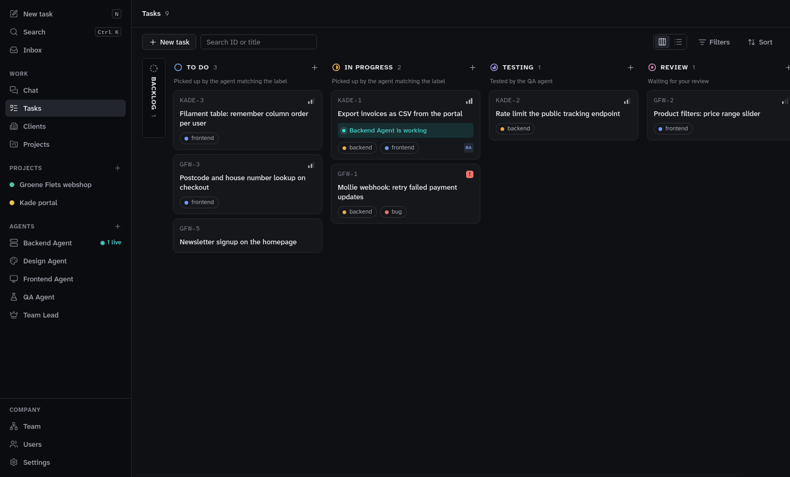

# Gizai

A desktop app where a team of coding agents (Claude Code, Codex, Gemini or another coding CLI) works through your software tasks. You keep clients, projects and tasks in Gizai. The agents pick up the cards, build each one in its own git worktree, test each other's work and hand it to you for review. You can also ask the Team Lead agent for things in chat.

Everything runs on your machine, with your own git repositories and your own logins. It's early (v0.1) and runs on Linux only for now. MIT licence.

## Install

You need:

- Linux with WebKitGTK 4.1;
- [Claude Code](https://docs.claude.com/en/docs/claude-code), installed and logged in (run `claude` once). Agents can also run on Codex, Gemini or another coding CLI you have installed and logged in (Settings → Coding CLIs); the Team Lead chat needs Claude Code;
- git, Rust ([rustup](https://rustup.rs)) and Node.js 20 or newer;
- optionally the [GitHub CLI](https://cli.github.com) and an SSH key on your GitHub account, to review cards as pull requests on GitHub. Settings → GitHub shows what's missing and can log gh in.

```sh
git clone --branch production https://github.com/Yotech-AI/gizai.git
cd gizai
./install.sh
```

The installer builds Gizai and installs it for your user in `~/.local`, with no sudo. It also adds Gizai to your app launcher. The `production` branch holds the released version; `main` is development.

| Command | What it does |
|---|---|
| `./install.sh --check` | Shows what is missing and the command that installs it |
| `./install.sh` | Installs, or updates (your data is backed up first) |
| `./install.sh --uninstall` | Removes Gizai and keeps your data in `~/.local/share/gizai` |

### Updates

Gizai asks GitHub for the latest release 20 seconds after it starts, then every six hours. When a newer one is out, **Update to X.Y.Z** shows above Company in the sidebar.

Click it and Gizai:

1. builds the new version from source in the background, while you keep working;
2. backs up your data;
3. installs the new version;
4. offers a restart.

If a step fails, the version you have keeps working, and Settings → Updates says why. Settings → Updates also has Check now, and switches the check off. You can still update from a terminal with `git pull` and `./install.sh`.



## Features

- Clients with contacts, projects with docs and files
- Tasks on a board or in a list, with labels, priorities, acceptance criteria and an Inbox
- Agents for each role (frontend, backend, design, QA, DevOps), with their own model, effort and allowed commands
- Folders per agent besides its worktree, each set to read or read and change (agent form → Permissions). They limit the agent's file tools, not the commands it runs; `/`, your home folder, Gizai's data and folders with keys are refused
- Each agent runs on the coding CLI you pick: Claude Code, Codex, Gemini, any other CLI (its output is read as text), or a second account of one with its own environment (`CLAUDE_CONFIG_DIR`, `CODEX_HOME`). Settings → Coding CLIs adds them, or finds the ones installed
- A git worktree and branch for every card, started from main on GitHub when the project is linked
- Worktrees that start warm: per project, paths copied from your checkout (`cp --reflink=auto`), missing dependencies installed (`composer install`, `npm ci`) and a setup command; a new card takes over a finished card's worktree, and Settings → Data removes old ones
- A card flow: Backlog → To do → In progress → Testing → Review → Deploy → Done, set up on the Team page (Team → Workflow). Each column holds the agents that work its cards, is Auto (its agents pick up its cards by priority as they have room) or Manual (only Run starts one), and links to the column its cards go to next. Add your own columns (a Design column with a design agent, linked to Review), drag them into any order, or remove one
- The column decides, labels don't: starting a card in To do moves it to To do's next column, and an agent's done answer moves it on (In progress → Testing → your Review). A card assigned to an agent is started only by that agent; a failed test sends a card back to the column it came from, to its builder. A card with Testing off skips Testing columns, and a DevOps run never sends a card to QA
- Labels are tags for people, such as Must have and Could have: create, rename, recolour and remove them on the Team page
- Review on GitHub: Open pull request pushes a card's branch over SSH with your keys (or HTTPS with gh's login) and opens its pull request with gh; a merge on GitHub moves the card to Review's next column (Deploy; Done for a team without a Deploy column) and removes its worktree
- Archive a card in Done: it leaves the board and every list, and keeps its ID, comments, runs and branch. The bin on the Tasks page lists archived cards, and Restore puts one back in Done
- Deploy: Manual by default, so no agent starts there by itself. Press Run for the agent on the column (its `deployed` moves the card to Deploy's next column, Done), or deploy it yourself and drag the card to Done
- Settings → GitHub: whether gh is found and logged in, how pushes go, Check connection for every linked project, and Log in with GitHub; Gizai never stores a token or password
- Agents that start when you press Run or when a card lands in an Auto column they are on (or is assigned to them there), on several cards at once. A start that can't work (Claude Code missing or not logged in, a wrong model, no repository) holds the card "blocked" without counting as a failed run, and that agent takes no new cards until you start or edit it (or Gizai restarts)
- Live run output, run history with the reason each run ended and the commits it made, and Continue. A run that ends without its result is continued once by itself
- The Team Lead chat, which manages clients, projects, tasks and agents with Gizai's own tools
  - Runs on, under the text box, moves one chat to another Claude Code account (Settings → Coding CLIs), for example when one is near its weekly limit. The new account gets the conversation handed over, and the chat notes the switch. An answer that hits a usage limit offers Answer on another account.
  - Messages you send while the Team Lead answers wait in a queue and go together when the answer is done. After a stopped or failed answer they wait for Send now.
- The Team Lead's board check (agent settings → Chat → Check the board every 15 min, off until you turn it on): it looks for answered questions, held and stuck cards, and cards no agent will start. Only something new starts it: it gets agents going again (Continue or Run) and asks you what it can't decide in a chat of its own, labelled Question or Approval, at the top of your Inbox. Dragging a held card back to To do or In progress takes the hold off
- The Team Lead reads its own read-only copy of each active project's code (`<data dir>/code/<KEY>`, a worktree without a branch), kept at the commit a new card starts from and refreshed before each answer; your own checkouts are never passed to it
- When a project's linked folder has dependencies behind main (`vendor/` or `node_modules/` missing, or a lock file that differs from main's), the Team Lead tells you what an update would do and, after your yes, updates it: a fast-forward to main (switching branch only if you agreed), then `composer install` or `npm ci`, never a merge, reset or the setup command
- An org chart of your team: the Team Lead on top, then branches (Design, Development, Quality, Operations and your own), each with one empty spot that adds an agent there. Drag an agent onto a column in Team → Workflow to put it to work there
- Time and tool-call limits per run, a spending limit per run, a monthly budget per agent
- Usage (in Company): the agents' input tokens (cache included), output tokens and API cost for today, 7 days, 30 days or this month, in total with a bar per day, per agent and per project, with the Team Lead's chat on its own line. The Projects list shows each project's API cost this month. API cost is what the tokens would cost at API prices, not a bill; a CLI that reports no cost (Codex, Gemini) shows its tokens and an unknown cost
- Updates from GitHub Releases: a notice in the sidebar, a build in the background, a backup first, then a restart
- A backup before every update, one Gizai per data folder, no telemetry (the release check only asks GitHub for the latest release)

## How agent runs work

Agent runs are headless: nobody is there to approve anything while one runs, so a command or tool call that needs approval is refused.

- **A temp folder per card.** Each card's worktree has a `.gizai-tmp/` folder. Before every run Gizai makes it, empty, and sets `TMPDIR`, `TMP` and `TEMP` to it for every CLI. So `mktemp`, PHP's `sys_get_temp_dir()`, Node's `os.tmpdir()` and Python's `tempfile` write inside the worktree, where the agent may write. Gizai adds `/.gizai-tmp/` once to the repository's `.git/info/exclude`, which your checkout and every worktree share, so the folder never shows in `git status`; `.gitignore` is left alone. The folder is emptied when the run ends, also after Stop or a limit, and goes with the worktree.
- **The rules in every prompt.** Every task prompt, new or continued, ends with "How this run works": nobody can approve anything, the commands the agent may run (its allowed list), the shell rules of its CLI and the temp folder's path. For Claude Code in acceptEdits mode (the default), checked against Claude Code 2.1.289:
  - commands and file tools reach only the worktree and the agent's folders: `ls /tmp`, `ls ..`, a redirect to `/tmp` and the Write tool on `/tmp` are refused, also for an allowed command;
  - `$(…)`, backticks, variables such as `$TMPDIR` and heredocs with an unquoted delimiter (`<<EOF`) are refused;
  - pipes, `2>&1`, `&&` and `;` between allowed commands work, and so does a redirect to a file in the worktree.

  Codex and Gemini hear only what holds for them: Codex asks for nothing and its sandbox blocks what it doesn't allow; Gemini hears its allowed commands.
- **Waiting in a run.** Ending its message ends an agent's run, and nothing wakes it up later. So "How this run works" also says how to wait for something outside the run, like a CI run, a release or deploy workflow or a pull request's checks: check it in the foreground about once a minute (one check, then `sleep 45`, in one command, and again), and when it won't be done before the run's limit, end with the result line and say what is left. `sleep` is named only for an agent that may run it. Checked against Claude Code 2.1.289: a command that starts with a sleep of more than 20 seconds is blocked, most shell loops are refused, a command that runs more than 2 minutes (or its own timeout, at most 10) is moved to the background, and a background command is stopped when the message ends.
- **One nudge.** A run that ends normally without its `GIZAI_RESULT` line is continued once by itself, in the same session, like Continue: Gizai tells the agent that nothing wakes it up later, to check in the foreground now if it was waiting, and to end with its result line. It never does this after Stop, a time or tool-call limit, a failed run or Gizai quitting, and only when a start is allowed now (agents not paused, the agent active, within its budget and cards at once, and room in Runs at once); otherwise nothing changes. If the nudged run also ends without a result, the card goes on hold "stalled" and shows in the Inbox.
- **New agents' commands.** New agents start with the usual git, package manager and test commands, the read-only helpers agents use in pipes (`head`, `tail`, `wc`, `sort`, `uniq`, `cut`, `diff`, `grep`, `jq`, `pwd`, `which` and `tree`), and `sleep`, to wait between checks. An agent with its own list needs `Bash(sleep:*)` added to it to wait that way.
- **Refused in this run.** Claude Code reports every tool call it refused, with the reason. Gizai saves them on the run: the Run panel lists them under "Refused in this run", Show output marks each one where it happened, and the Team Lead's `get_task` and `get_agent` return them for each run. Codex and Gemini don't report refusals, so their runs list none.

## MCP servers for agents

Agents can use outside services through MCP servers, like Otus OS. Settings → MCP servers holds one list for all agents: add a server by hand (a command, or an address) or **Import from Claude Code**, which reads the servers your Claude Code accounts already have (read only, values into the keychain). **List tools** shows what each tool does, its parameters and its risk before you switch anything on. A server that asks for it gets **Sign in**: Gizai signs in as a device of its own, in your default browser.

Everything is off until you switch it on per agent, in the agent form → Tools, with a switch per server and per tool. Environment values, headers and sign-in tokens stay in the OS keychain, never in Gizai's database. After a chat answer used an outside tool, the Team Lead asks you to confirm before it starts runs or changes agents or columns. On Claude Code for now; Codex and Gemini follow. Details: [docs/agent-tools.md](docs/agent-tools.md).

## Development

```sh
source scripts/env.sh
cargo test --workspace && npm test
scripts/ui-test.sh        # UI tests in a headless compositor, never on your desktop
scripts/readme-gif.sh     # remakes the GIF above
```

`CLAUDE.md` has the rules for working in this repository, `docs/HANDOFF-2026-10-07.md` explains how it is built, and `docs/RELEASING.md` how a release is made.

## Licence

MIT, see [LICENSE](LICENSE). Gizai is not affiliated with Anthropic. Claude and Claude Code are trademarks of Anthropic.
