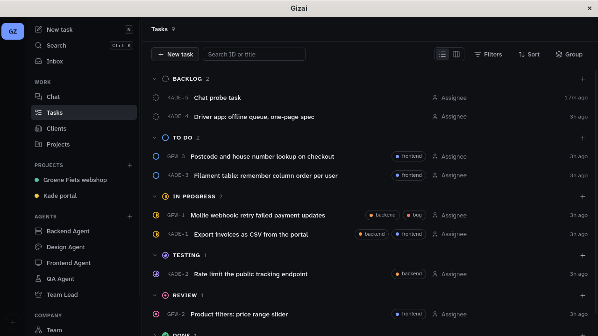
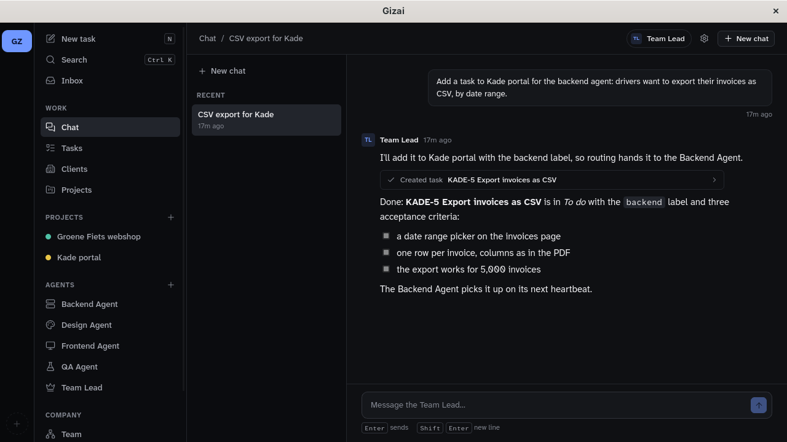
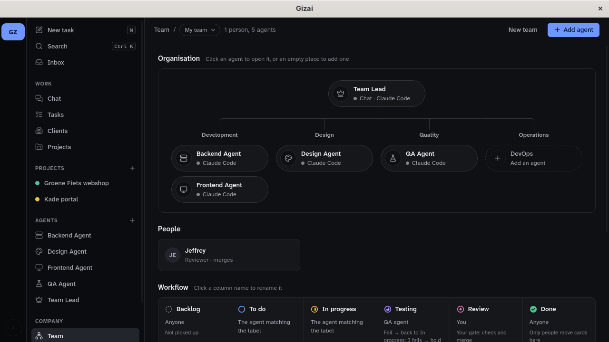

# Gizai

Gizai is a desktop app for running software work with AI agents. You keep your clients, projects, docs and tasks in it; a team of Claude Code agents picks tasks up, builds them in their own git branches and hands them on, from building to testing to your review. If you'd rather talk than drag cards, a Team Lead agent does the same through chat.

Everything runs on your machine: one SQLite file, your own git repositories and your own Claude Code login. MIT licensed.



> **Status: early.** Gizai is at v0.x and runs on Linux. macOS and Windows builds come later. Expect rough edges, and keep backups of anything you can't lose.

## What it does

- **Clients, projects and docs.** Clients with contacts, projects with a goal, a linked git repository, Markdown docs with versions, and files.
- **Tasks.** A list grouped by status and a board, with filters, labels, priorities and acceptance criteria. Press `N` anywhere for a new task, `Ctrl K` to search.
- **Agents that do the work.** Each agent is Claude Code with a role (Frontend, Backend, Design, QA, DevOps or your own), a model and effort level picked from what your Claude Code offers, instructions, a permission mode and the commands it may run.
  - Routing rules hand cards to the right role.
  - Agents work in a git worktree per task, on branch `gizai/<task>`, and never push or merge.
  - QA checks the acceptance criteria. A failed check goes back to the builder with numbered issues; a passed one lands in Review for you.
- **Chat with the Team Lead.** Ask in plain words: "add a client", "plan this project as tasks", "what needs me?". The Team Lead uses Gizai's own tools to add clients, projects, tasks and agents, write docs, attach files and read your inbox. Every change shows up as a card in the chat that links to what it made.
- **Your inbox.** Cards on hold (an agent needs a decision, a run kept failing) and cards waiting for your review.





## Install

You need:

- **Linux** with WebKitGTK 4.1 (any current Arch, Debian/Ubuntu, Fedora or openSUSE).
- **[Claude Code](https://docs.claude.com/en/docs/claude-code)**, installed and logged in: run `claude` once. Gizai runs it with your own subscription or API key and never sees your login.
- **git**. To build from source you also need **Rust** ([rustup](https://rustup.rs)) and **Node.js 20 or newer**.

### With the installer

```sh
git clone https://github.com/Yotech-AI/gizai.git
cd gizai
./install.sh
```

The installer:

- checks what is missing and prints the exact command for your distribution;
- builds Gizai;
- installs it for your user only, with no sudo: `~/.local/lib/gizai`, the `gizai` command in `~/.local/bin`, and an entry in your app launcher.

Run it again to update. Other options:

| Command | What it does |
|---|---|
| `./install.sh --check` | Only report what is missing |
| `./install.sh --uninstall` | Remove Gizai; your data stays |
| `./install.sh --uninstall --purge` | Remove Gizai and your data |

Without a checkout:

```sh
curl -fsSL https://raw.githubusercontent.com/Yotech-AI/gizai/main/install.sh | GIZAI_REPO=https://github.com/Yotech-AI/gizai.git bash
```

### By hand

```sh
npm ci
npm run tauri build -- --no-bundle
cargo build --release -p gizai-mcp      # the helper the chat needs, next to the app
target/release/gizai
```

`scripts/run.sh` does the same and rebuilds only when sources changed. On machines without an NVIDIA GPU it points WebKitGTK at Mesa's EGL; the installed launcher does this too.

## First steps

1. **Set up the Team Lead.** Open **Chat** and press **Set up the Team Lead**. The agent form opens with Chat turned on; save it.
2. **Add a project with a repository.** Ask the Team Lead, or use **Projects → New project** and choose the project's local git repository. Agents only work on projects with a repository.
3. **Add your team.**
   - On the **Team** page, click an empty place in the org chart (Frontend, Backend, QA, …) to add that agent.
   - Choose how each one wakes up: when you press Run, when a card is assigned to it, or every N minutes.
   - **Add the usual rules** sends `frontend` and `backend` cards to those agents and Testing cards to QA.
4. **Create a task** with a clear description and acceptance criteria, label it, and press **Run** on the task page or wait for the agent to wake up. The run panel shows what the agent does; **Stop** ends it.
5. **Review and merge.** Cards that pass QA wait in Review for you. Look at the branch, merge it yourself, and move the card to Done.

### How a card moves

| The agent ends with | The card goes to |
|---|---|
| `ready_for_testing` (a builder) | Testing |
| `qa_pass` (QA) | Review, assigned to you |
| `qa_fail` (QA) | back to In progress with QA's numbered issues; the third bounce puts it on hold |
| `needs_decision` | on hold until you clear it (it shows in your Inbox) |
| no result, or a failed run | stays; the third one puts it on hold |

## Safety

- **Agents work only in their own git worktree.** Their instructions forbid push, merge and branch changes; only you merge. Each agent has a permission mode and a list of commands it may run without asking, so trim it per agent.
- **Your own Claude Code hooks and skills don't run in agents.** Headless agents and the chat run with `disableAllHooks` and without slash commands. A repository's settings and MCP servers are not loaded.
- **The chat doesn't edit code or run commands itself.** The Team Lead runs Claude Code in restricted mode:
  - it may read files in your linked git repositories;
  - it reaches Gizai only through its tools, on a socket only your user can open, with a key that lives for one answer.

  Through those tools it can create and start agents. It can't give them `bypassPermissions` or unlimited shell access; only you can, in the agent form. It also can't link a folder that isn't a git repository, and it attaches only files you named in the chat or that sit inside a linked repository.
- **There are limits.** A run stops after 45 minutes or 80 tool calls; a chat answer after 15 minutes or 60. There is an optional spending limit per run and a monthly budget per agent.
- **Your data stays on your machine.** Data lives in `~/.local/share/gizai/` (change it with `GIZAI_DATA_DIR`). There is no telemetry. Gizai talks to no server; Claude Code talks to Anthropic as usual.

| Path | What |
|---|---|
| `gizai.db` | everything you enter (SQLite); every change is also logged |
| `files/` | uploaded files, stored once by content |
| `worktrees/<project>/<task>` | the agents' git worktrees |
| `runs/`, `chat/` | each agent run's and chat answer's raw Claude Code output |

## Development

```sh
source scripts/env.sh        # keeps cargo and npm caches inside the repository
cargo test --workspace       # core, agents, MCP tools, chat turns (with a fake Claude Code)
npm test                     # UI logic
npm run build
scripts/ui-test.sh           # six UI tests in a headless cage compositor (never on your desktop)
scripts/test-install.sh      # the installer, against a scratch home folder
```

The repository is laid out like this:

- `crates/gizai-core`: the SQLite store, the domain, the workflow gates and the chat records (no Tauri).
- `crates/gizai-agents`: the Claude Code command line, stream parsing, worktrees and process control.
- `crates/gizai-mcp`: the MCP protocol, and the `gizai-mcp` stdio helper that connects Claude Code to Gizai.
- `src-tauri`: the app, its commands, the run manager, chat turns, and the Team Lead's tools.
- `src`: the React UI. `api.ts` is the only file that talks to Tauri.
- `design/`: the design tokens and the generator for the design system.

`src-tauri/examples/chat_probe.rs` runs one real chat turn against a scratch folder. It spends a little, so it's for checking a new Claude Code version by hand.

## Licence

MIT, see [LICENSE](LICENSE). Gizai is not affiliated with Anthropic. Claude and Claude Code are trademarks of Anthropic.
